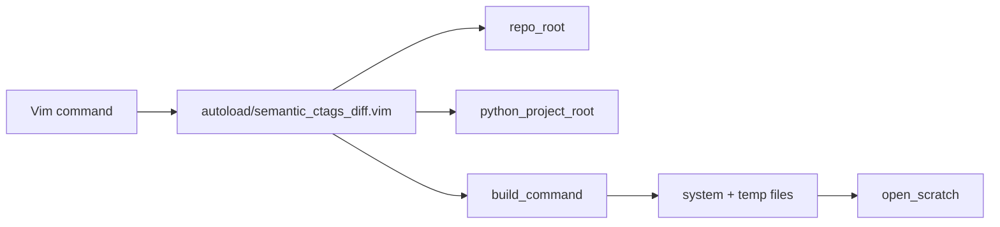

# vim-semantic-ctags-diff

Vim 8 plugin that runs **semantic branch diffs** from your editor by calling the
[semantic-branch-diff](https://github.com/rafaelrojasmiliani/semantic-ctags-diff)
Python tool (PyDriller + ctags). Results open in scratch buffers as Markdown or
JSON.

Works with **vim-fugitive** worktree detection (submodules) and optional
**vim-flog** log navigation.

## Overview

```
:SemanticCtagsDiff main HEAD
        │
        ▼
  semantic-branch-diff (Python)
        │
        ▼
  Markdown scratch buffer
  (symbols added / removed / modified)
```

### Screenshot placeholders

<!--  -->
<!--  -->
<!--  -->

_Text placeholders — add screenshots under `docs/screenshots/` when available._

## Requirements

| Tool | Required |
|------|----------|
| Vim 8+ | Yes |
| Git | Yes |
| Python 3 + `semantic-branch-diff` | Yes |
| Universal Ctags | Yes |
| vim-fugitive | Recommended |
| vim-flog | Optional |

## Installation

### Plugin manager (vim-plug)

```vim
Plug 'rafaelrojasmiliani/ctags-difftastic-semantic-diff-vim'
```

Then:

```bash
git submodule update --init --recursive
pip install -e submodules/semantic-ctags-diff
```

Inside Vim:

```vim
:helptags /path/to/plugin/doc
:help semantic-ctags-diff
```

### Pathogen / native package

Clone into your bundle path and run the same submodule + pip steps.

## Configuration

```vim
let g:semantic_ctags_diff_default_base = 'main'
let g:semantic_ctags_diff_python = 'python3'
let g:semantic_ctags_diff_ctags = 'ctags'
let g:semantic_ctags_diff_use_fugitive_worktree = 1
let g:semantic_ctags_diff_debug = 0
let g:semantic_ctags_diff_open_cmd = 'botright new'

" Optional: explicit Python project path
" let g:semantic_ctags_diff_root = '/path/to/semantic-ctags-diff'

" Optional: extra CLI flags
" let g:semantic_ctags_diff_extra_args = ['--no-pydriller-methods']
```

Python project auto-detection looks for:

- `submodules/semantic-ctags-diff/pyproject.toml`
- `submodules/sematic-ctags-diff/pyproject.toml` (typo fallback)

## Commands

| Command | Description |
|---------|-------------|
| `:SemanticCtagsDiff [base] [head]` | Markdown scratch buffer |
| `:SemanticCtagsDiffJson [base] [head]` | JSON scratch buffer |
| `:SemanticCtagsDiffCurrent` | Use configured defaults |
| `:SemanticCtagsDiffMain` | `main` vs `HEAD` |
| `:SemanticCtagsDiffOriginMain` | `origin/main` vs `HEAD` |
| `:SemanticCtagsDiffRefresh` | Re-run last query |
| `:SemanticCtagsDiffCopyCommand` | Copy shell command to `+` register |
| `:SemanticCtagsDiffDebugLog` | Open debug log |
| `:SemanticCtagsDiffClearDebugLog` | Clear debug log |
| `:SemanticCtagsDiffFlog` | Flog companion (if flog installed) |
| `:SemanticCtagsDiffFlogSymbol` | Pick symbol → Flog history (if flog installed) |

### Suggested mappings (not installed by default)

```vim
nnoremap <leader>sd :SemanticCtagsDiff<CR>
nnoremap <leader>sj :SemanticCtagsDiffJson<CR>
nnoremap <leader>sr :SemanticCtagsDiffRefresh<CR>
nnoremap <leader>sl :SemanticCtagsDiffDebugLog<CR>
```

## Vim / Fugitive / Flog integration

### Fugitive

When vim-fugitive is loaded, repo root uses `FugitiveWorkTree()` so semantic
diffs target the correct worktree inside **submodules** and **nested
submodules**.

Without fugitive, the plugin falls back to:

```bash
git -C <current-file-dir-or-cwd> rev-parse --show-toplevel
```

### Flog

`:SemanticCtagsDiffFlog` opens a raw `base..head` log view as a navigation
companion (less semantic than the Python report).

`:SemanticCtagsDiffFlogSymbol` lists **modified symbols** from the cached JSON
result, opens the file at the symbol line, and delegates to your existing
`:FlogsplitSymbol`, `:FlogsplitFunction`, `:FlogsplitClass`, or
`:FlogsplitNamespace` commands when defined.

This plugin does **not** define Flogsplit commands or mappings.

## Architecture



## Limitations

- **Synchronous** execution (`system()`); large branches may block Vim.
- Default file extensions target **C/C++**; configure `g:semantic_ctags_diff_include`.
- **Vim 8 only** — no Neovim-only APIs, no Lua, no `jobstart()`.
- No default mappings.
- `:SemanticCtagsDiffFlogSymbol` requires a prior diff (JSON cache is fetched
  automatically after Markdown runs).

## Troubleshooting

See `:help semantic-ctags-diff-troubleshooting` for:

- ctags not found
- Python module not found
- Submodule path missing
- Wrong repo root in submodules
- Empty results
- Slow runs

Quick debug:

```vim
let g:semantic_ctags_diff_debug = 1
:SemanticCtagsDiff main HEAD
:SemanticCtagsDiffDebugLog
:SemanticCtagsDiffCopyCommand
```

## License

Same as the parent repository.
