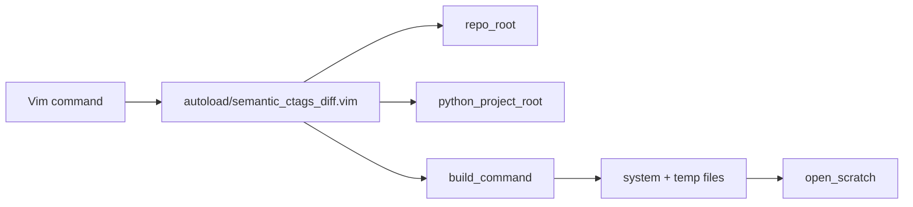

# vim-semantic-ctags-diff

[](https://github.com/rafaelrojasmiliani/ctags-difftastic-semantic-diff-vim/actions/workflows/ci.yml)

Vim 8 plugin with two complementary features:

1. **Semantic branch diffs** — calls the
   [semantic-branch-diff](https://github.com/rafaelrojasmiliani/semantic-ctags-diff)
   Python tool (PyDriller + ctags) and opens the result in Markdown/JSON scratch
   buffers.
2. **Difftastic in Vim** — a Fugitive-style file diff rendered with
   [difftastic](https://github.com/Wilfred/difftastic) (`difft`) via
   `:Gdifftastic` / `:Gvdifftastic`. This ports difftastic's structural diff into
   a Vim scratch window.

Works with **vim-fugitive** worktree detection (submodules) and optional
**vim-flog** log navigation. The two features are independent: difftastic needs
only `git` + `difft`, and the Python module gracefully handles difftastic being
absent.

**Ctags note:** This plugin does **not** require ctags built with JSON output
(`--output-format=json`). The Python tool runs ordinary ctags (`-f tags`) and
reads the classic tags file via `python-ctags3`. Universal Ctags is recommended;
Exuberant Ctags works with reduced C++ metadata. `:SemanticCtagsDiffJson` refers
to the semantic **report** format, not ctags JSON.

## How it works: ctags line ranges

Everything this plugin shows in a semantic diff comes from **ctags symbol line
ranges** plus **Git line changes**:

| Layer | Role |
|-------|------|
| Git | Which files/lines changed between `base` and `head` |
| ctags | Each symbol’s start/end line, kind, and qualified name |
| Python | Map changed lines → symbols; classify added/removed/modified |

The Vim plugin does **not** parse ctags itself. It calls
`semantic-branch-diff`, which runs ctags on file snapshots and matches Git diff
lines to enclosing symbols (function, method, class, …).

### Example

You change line 13 inside a method body:

```cpp
void RobotController::configure(double x) {  // ctags: lines 12–15
  m_gain = x;   // ← you edit this line (line 13)
}
```

- **Plain git diff:** `@@ … +13,1 @@` — one line changed.
- **Semantic diff:** `modified function ImFusion::Robotics::RobotController::configure`
  because line 13 falls inside ctags range 12–15.

From Vim:

```vim
:SemanticCtagsDiff main HEAD
```

The Markdown scratch buffer lists **symbols**, not just hunks. JSON output
includes `new_range: [12, 15]` and `flog_limit: "12,15:src/RobotController.cpp"`
for Flog navigation.

Run the bundled example (no Git repo needed):

```bash
cd submodules/semantic-ctags-diff
semantic-branch-diff \
  --old-dir examples/01_added_methods/old \
  --new-dir examples/01_added_methods/new \
  --format markdown
```

See the Python library README for the full model and limitations (file-scope
changes, untagged regions, estimated end lines on Exuberant ctags).

## Overview

```
:SemanticCtagsDiff main HEAD
        │
        ▼
  semantic-branch-diff (Python)
        │
        ▼
  Markdown scratch buffer
  (symbols added / removed / modified)
```

### Screenshot placeholders

<!--  -->
<!--  -->
<!--  -->

_Text placeholders — add screenshots under `docs/screenshots/` when available._

## Requirements

| Tool | Required |
|------|----------|
| Vim 8+ | Yes |
| Git | Yes |
| Python 3 + PyDriller + python-ctags3 | For semantic diff (importable; no pip install of this repo) |
| Universal Ctags (or Exuberant) | For semantic diff — classic tags file, **not** JSON output |
| difftastic (`difft`) | For `:Gdifftastic` / `:Gvdifftastic` only |
| vim-fugitive | Recommended |
| vim-flog | Optional |

The semantic diff and difftastic features are independent — you can use
`:Gdifftastic` with only `git` + `difft`, even without Python or ctags.

## Installation

### Plugin manager (vim-plug)

```vim
Plug 'rafaelrojasmiliani/ctags-difftastic-semantic-diff-vim'
```

Then:

```bash
git submodule update --init --recursive
```

Inside Vim:

```vim
:helptags /path/to/plugin/doc
:help semantic-ctags-diff
```

No `pip install` of `semantic-branch-diff` is required. The plugin runs the
submodule source directly:

```bash
PYTHONPATH=submodules/semantic-ctags-diff python3 -m semantic_branch_diff.cli ...
```

Python still needs importable **PyDriller** and **python-ctags3** (system packages,
your own venv, or `submodules/semantic-ctags-diff/.venv/` if you create one for
deps only).

### Pathogen / native package

Clone into your bundle path and run the same submodule + pip steps.

## Configuration

```vim
let g:semantic_ctags_diff_default_base = 'main'
let g:semantic_ctags_diff_python = 'python3'
let g:semantic_ctags_diff_ctags = 'ctags'
let g:semantic_ctags_diff_use_fugitive_worktree = 1
let g:semantic_ctags_diff_debug = 0
let g:semantic_ctags_diff_open_cmd = 'botright new'
let g:semantic_ctags_diff_cache = 1
let g:semantic_ctags_diff_cache_dir = '/tmp/semantic_ctags_diff'

" Optional: explicit Python source tree (default: auto-detect submodules/semantic-ctags-diff)
" let g:semantic_ctags_diff_root = '/path/to/semantic-ctags-diff'

" Optional: Python with PyDriller + python-ctags3 (or submodule .venv/bin/python3)
" let g:semantic_ctags_diff_python = '/path/to/submodules/semantic-ctags-diff/.venv/bin/python3'

" Optional: extra CLI flags
" let g:semantic_ctags_diff_extra_args = ['--no-pydriller-methods']

" Difftastic (:Gdifftastic / :Gvdifftastic)
let g:semantic_ctags_diff_difft = 'difft'
let g:semantic_ctags_diff_difftastic_display = 'side-by-side'  " or 'inline'
let g:semantic_ctags_diff_difftastic_context = 3
```

Python project auto-detection looks for:

- `submodules/semantic-ctags-diff/pyproject.toml`
- `submodules/sematic-ctags-diff/pyproject.toml` (typo fallback)

## Result cache

`:SemanticCtagsDiff` can be slow on large repos. Successful results are cached
under `/tmp/semantic_ctags_diff/<repo-name>/` (never in your workspace), named
after the **resolved commits** being compared:

```
/tmp/semantic_ctags_diff/my-project/a1b2c3d4..e5f6g7h8.markdown
/tmp/semantic_ctags_diff/my-project/a1b2c3d4..e5f6g7h8.json
```

When `main` or `HEAD` moves to a new commit, the filename changes and the diff
is recomputed automatically. Same commit pair → instant reload.

- Repeat runs echo `using cached result`.
- `:SemanticCtagsDiffRefresh` always bypasses the cache and re-runs Python.
- `:SemanticCtagsDiffClearCache` deletes all cached files.
- Disable with `let g:semantic_ctags_diff_cache = 0`.

## Commands

| Command | Description |
|---------|-------------|
| `:SemanticCtagsDiff [base] [head]` | Markdown scratch buffer |
| `:SemanticCtagsDiffJson [base] [head]` | JSON scratch buffer |
| `:SemanticCtagsDiffCurrent` | Use configured defaults |
| `:SemanticCtagsDiffMain` | `main` vs `HEAD` |
| `:SemanticCtagsDiffOriginMain` | `origin/main` vs `HEAD` |
| `:SemanticCtagsDiffRefresh` | Re-run last query (bypasses cache) |
| `:SemanticCtagsDiffClearCache` | Delete cached results from `/tmp` |
| `:SemanticCtagsDiffCopyCommand` | Copy shell command to `+` register |
| `:SemanticCtagsDiffDebugLog` | Open debug log |
| `:SemanticCtagsDiffClearDebugLog` | Clear debug log |
| `:SemanticCtagsDiffFlog` | Flog companion (if flog installed) |
| `:SemanticCtagsDiffFlogSymbol` | Pick symbol → Flog history in a new tab (if flog installed) |
| `:FlogSymbol` / `:FlogFunction` / `:FlogClass` / `:FlogNamespace` | Cursor symbol history in a **new tab** |
| `:FlogsplitSymbol` / `:FlogsplitFunction` / ... | Cursor symbol history in a split |
| `:FlogFile` / `:FlogsplitFile` | **Single-file** history (`-path=`); `<CR>`/`dd` show only that file |
| `:FlogInclude` / `:FlogsplitInclude` | `#include` under cursor → history of the resolved header |
| `:Gdifftastic [ref]` | Difftastic diff of current file vs `ref` (default `HEAD`), horizontal split |
| `:Gvdifftastic [ref]` | Same, vertical split |

### Suggested mappings (not installed by default)

```vim
nnoremap <leader>sd :SemanticCtagsDiff<CR>
nnoremap <leader>sj :SemanticCtagsDiffJson<CR>
nnoremap <leader>sr :SemanticCtagsDiffRefresh<CR>
nnoremap <leader>sl :SemanticCtagsDiffDebugLog<CR>
nnoremap <leader>dt :Gvdifftastic<CR>
```

## Difftastic in Vim

This plugin also **ports difftastic into Vim** as a Fugitive-style file diff.
`difft` is a structural (syntax-aware) diff tool; these commands run it as git's
external diff and render the result in a scratch buffer.

| Command | Effect |
|---------|--------|
| `:Gdifftastic` | Difftastic diff of the current file vs `HEAD`, horizontal split |
| `:Gdifftastic origin/main` | vs any ref (branch, tag, commit) |
| `:Gvdifftastic [ref]` | Same, vertical split |

Under the hood it runs, for the current file:

```bash
DFT_DISPLAY=side-by-side DFT_COLOR=never \
  git -C <worktree> -c diff.external=difft --no-pager diff --ext-diff <ref> -- <file>
```

So difftastic receives the old/new blobs straight from git, exactly like
`:Gdiffsplit` does for a normal diff. Output is a read-only scratch buffer with a
header (file, ref, repo, exact command).

Notes:

- Requires `difft` on `PATH` (or set `g:semantic_ctags_diff_difft`).
- Independent of the Python module and ctags — works with only `git` + `difft`.
- The commands are defined only if not already present, so they won't clobber
  your own `:Gdifftastic` mapping.
- Configure via `g:semantic_ctags_diff_difftastic_display` (`side-by-side` or
  `inline`) and `g:semantic_ctags_diff_difftastic_context`.

## Jump to a symbol from the report

In the `:SemanticCtagsDiff` (Markdown) report, press a key on any symbol line to
open its source, mirroring vim-fugitive conventions:

| Key | Opens the symbol in |
|-----|---------------------|
| `<CR>` | current window |
| `o` | horizontal split |
| `gO` | vertical split |
| `O` | new tab |

Where it opens depends on the change type:

- **Added / modified** symbols live in `head`, so the on-disk **working-tree**
  file is opened at the symbol's line. If the current checkout does not contain
  that file, it falls back to `:Gedit <head>:<path>` (fugitive) — the file as it
  exists in the head commit.
- **Removed** symbols no longer exist in the working tree, so they open with
  `:Gedit <base>:<path>` — the file at the base commit where the symbol still
  exists.

Added symbols resolve their path/line from the cached JSON, so run a diff first
(the JSON is fetched automatically after `:SemanticCtagsDiff`). The fugitive
fallback and removed-symbol view require **vim-fugitive**.

> ponytail: added/modified jumps assume your checkout is at `head`. On a
> different checkout the working file opens but the line may be slightly off;
> use `:Gedit <head>:<path>` for the exact head version.

## Vim / Fugitive / Flog integration

### Fugitive

When vim-fugitive is loaded, repo root uses `FugitiveWorkTree()` so semantic
diffs target the correct worktree inside **submodules** and **nested
submodules**.

Without fugitive, the plugin falls back to:

```bash
git -C <current-file-dir-or-cwd> rev-parse --show-toplevel
```

### Flog

`:SemanticCtagsDiffFlog` opens a raw `base..head` log view as a navigation
companion (less semantic than the Python report).

`:SemanticCtagsDiffFlogSymbol` lists **modified symbols** from the cached JSON
result (using the Python `navigation` list when available), then opens Flog with
`flog_limit` from the JSON. By default it opens a **new tab** (commit graph +
diff), exactly like plain `:Flog`. Set `g:semantic_ctags_diff_flog_open` to
`'Flogsplit'` to open a split instead:

```vim
let g:semantic_ctags_diff_flog_open = 'Flogsplit'  " default: 'Flog' (new tab)
```

### Cursor symbol history: new tab vs split

When vim-flog is installed, `plugin/semantic_ctags_flog.vim` defines two
families for the symbol under the cursor, **only if you have not already
defined them** (e.g. in a legacy `files` script):

| Command | Opens |
|---------|-------|
| `:FlogSymbol`, `:FlogFunction`, `:FlogClass`, `:FlogNamespace` | **New tab** (commit graph + diff), like `:Flog` |
| `:FlogsplitSymbol`, `:FlogsplitFunction`, `:FlogsplitClass`, `:FlogsplitNamespace` | Split of the current window |

Use the `:Flog*` (tab) family when you want the commits and diffs in a separate
view, the same way plain `:Flog` opens a dedicated tab. Both families call
Python `symbol-at` mode — **no Vim ctags parsing**, and **no ctags JSON output**
required:

```bash
semantic-branch-diff --symbol-at --file path.cpp --line 42 --kind function
```

### Single-file Flog (`:FlogFile`, `:FlogInclude`)

Plain `:Flog -path=file.cpp` filters the **commit list** to that file, but the
default flog keys still open the **whole commit** (`<CR>`) or diff all files
(`dd`). These commands fix that:

| Command | Opens |
|---------|-------|
| `:FlogFile` | File history in a **new tab**; `<CR>` and `dd` scoped to that file |
| `:FlogsplitFile` | Same, in a split |
| `:FlogInclude` | Resolve `#include` on cursor → header file history (new tab) |
| `:FlogsplitInclude` | Same, in a split |

Implementation: `Flog -path=<git-relative-path>` plus buffer-local remaps to
vim-flog's path-scoped plugs (`FlogVSplitCommitPathsRight`, `FlogVDiffSplitPathsRight`).
Disable remaps with `let g:semantic_ctags_diff_flog_file_maps = 0`.

`#include` resolution searches: directory of the current file → repo root →
`findfile()`. System includes (`#include <vector>`) only resolve inside the repo.

### Responsibility split (Python vs Vim)

| Concern | Python (`semantic-branch-diff`) | Vim plugin |
|---------|--------------------------------|------------|
| Branch semantic diff | Yes | Invokes CLI, scratch buffers |
| ctags execution + parsing | Yes (`python-ctags3`, classic tags) | No |
| Symbol priority / kind inference | Yes (`symbols.py`) | No |
| `flog_limit` strings | Yes (`navigation.py`) | Uses JSON field |
| Repo worktree detection | — | Yes (Fugitive / git) |
| Flog UI / colors | — | Yes |
| Difftastic file diff (`:Gdifftastic`) | — | Yes (git external diff → scratch) |
| Fugitive commit-prompt difftastic context | — | Not included (see `files` reference) |

This plugin does **not** define Flogsplit commands if you already have custom ones.

## Architecture



## Limitations

- **Synchronous** execution (`system()`); large branches may block Vim.
- Default file extensions target **C/C++**; configure `g:semantic_ctags_diff_include`.
- Does **not** need ctags JSON output; any standard Universal or Exuberant build works.
- **Vim 8 only** — no Neovim-only APIs, no Lua, no `jobstart()`.
- No default mappings.
- `:SemanticCtagsDiffFlogSymbol` requires a prior diff (JSON cache is fetched
  automatically after Markdown runs).
- `:Gdifftastic` renders difftastic's **plain-text** output in a scratch buffer
  (no ANSI colors, not true `vimdiff` mode); it needs `difft` installed.

## Troubleshooting

See `:help semantic-ctags-diff-troubleshooting` for:

- ctags not found
- PyDriller / python-ctags3 import errors (not a missing pip install of this repo)
- Submodule path missing
- Wrong repo root in submodules
- Empty results
- Slow runs

Quick debug:

```vim
let g:semantic_ctags_diff_debug = 1
:SemanticCtagsDiff main HEAD
:SemanticCtagsDiffDebugLog
:SemanticCtagsDiffCopyCommand
```

## License

Same as the parent repository.
