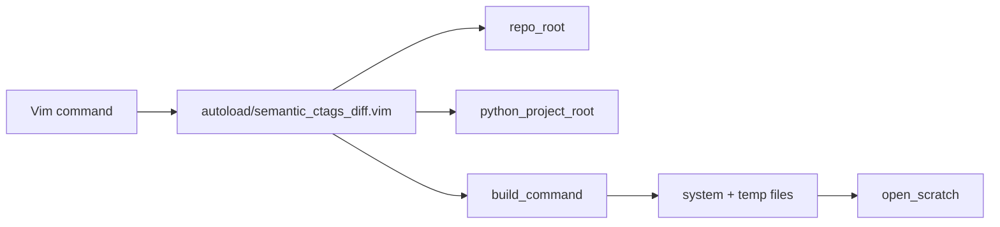

# vim-semantic-ctags-diff

Vim 8 plugin that runs **semantic branch diffs** from your editor by calling the
[semantic-branch-diff](https://github.com/rafaelrojasmiliani/semantic-ctags-diff)
Python tool (PyDriller + ctags). Results open in scratch buffers as Markdown or
JSON.

Works with **vim-fugitive** worktree detection (submodules) and optional
**vim-flog** log navigation.

**Ctags note:** This plugin does **not** require ctags built with JSON output
(`--output-format=json`). The Python tool runs ordinary ctags (`-f tags`) and
reads the classic tags file via `python-ctags3`. Universal Ctags is recommended;
Exuberant Ctags works with reduced C++ metadata. `:SemanticCtagsDiffJson` refers
to the semantic **report** format, not ctags JSON.

## How it works: ctags line ranges

Everything this plugin shows in a semantic diff comes from **ctags symbol line
ranges** plus **Git line changes**:

| Layer | Role |
|-------|------|
| Git | Which files/lines changed between `base` and `head` |
| ctags | Each symbol’s start/end line, kind, and qualified name |
| Python | Map changed lines → symbols; classify added/removed/modified |

The Vim plugin does **not** parse ctags itself. It calls
`semantic-branch-diff`, which runs ctags on file snapshots and matches Git diff
lines to enclosing symbols (function, method, class, …).

### Example

You change line 13 inside a method body:

```cpp
void RobotController::configure(double x) {  // ctags: lines 12–15
  m_gain = x;   // ← you edit this line (line 13)
}
```

- **Plain git diff:** `@@ … +13,1 @@` — one line changed.
- **Semantic diff:** `modified function ImFusion::Robotics::RobotController::configure`
  because line 13 falls inside ctags range 12–15.

From Vim:

```vim
:SemanticCtagsDiff main HEAD
```

The Markdown scratch buffer lists **symbols**, not just hunks. JSON output
includes `new_range: [12, 15]` and `flog_limit: "12,15:src/RobotController.cpp"`
for Flog navigation.

Run the bundled example (no Git repo needed):

```bash
cd submodules/semantic-ctags-diff
semantic-branch-diff \
  --old-dir examples/01_added_methods/old \
  --new-dir examples/01_added_methods/new \
  --format markdown
```

See the Python library README for the full model and limitations (file-scope
changes, untagged regions, estimated end lines on Exuberant ctags).

## Overview

```
:SemanticCtagsDiff main HEAD
        │
        ▼
  semantic-branch-diff (Python)
        │
        ▼
  Markdown scratch buffer
  (symbols added / removed / modified)
```

### Screenshot placeholders

<!--  -->
<!--  -->
<!--  -->

_Text placeholders — add screenshots under `docs/screenshots/` when available._

## Requirements

| Tool | Required |
|------|----------|
| Vim 8+ | Yes |
| Git | Yes |
| Python 3 + `semantic-branch-diff` | Yes |
| Universal Ctags (or Exuberant) | Yes — classic tags file, **not** JSON output |
| vim-fugitive | Recommended |
| vim-flog | Optional |

## Installation

### Plugin manager (vim-plug)

```vim
Plug 'rafaelrojasmiliani/ctags-difftastic-semantic-diff-vim'
```

Then:

```bash
git submodule update --init --recursive
pip install -e submodules/semantic-ctags-diff
```

Inside Vim:

```vim
:helptags /path/to/plugin/doc
:help semantic-ctags-diff
```

### Pathogen / native package

Clone into your bundle path and run the same submodule + pip steps.

## Configuration

```vim
let g:semantic_ctags_diff_default_base = 'main'
let g:semantic_ctags_diff_python = 'python3'
let g:semantic_ctags_diff_ctags = 'ctags'
let g:semantic_ctags_diff_use_fugitive_worktree = 1
let g:semantic_ctags_diff_debug = 0
let g:semantic_ctags_diff_open_cmd = 'botright new'

" Optional: explicit Python project path
" let g:semantic_ctags_diff_root = '/path/to/semantic-ctags-diff'

" Optional: extra CLI flags
" let g:semantic_ctags_diff_extra_args = ['--no-pydriller-methods']
```

Python project auto-detection looks for:

- `submodules/semantic-ctags-diff/pyproject.toml`
- `submodules/sematic-ctags-diff/pyproject.toml` (typo fallback)

## Commands

| Command | Description |
|---------|-------------|
| `:SemanticCtagsDiff [base] [head]` | Markdown scratch buffer |
| `:SemanticCtagsDiffJson [base] [head]` | JSON scratch buffer |
| `:SemanticCtagsDiffCurrent` | Use configured defaults |
| `:SemanticCtagsDiffMain` | `main` vs `HEAD` |
| `:SemanticCtagsDiffOriginMain` | `origin/main` vs `HEAD` |
| `:SemanticCtagsDiffRefresh` | Re-run last query |
| `:SemanticCtagsDiffCopyCommand` | Copy shell command to `+` register |
| `:SemanticCtagsDiffDebugLog` | Open debug log |
| `:SemanticCtagsDiffClearDebugLog` | Clear debug log |
| `:SemanticCtagsDiffFlog` | Flog companion (if flog installed) |
| `:SemanticCtagsDiffFlogSymbol` | Pick symbol → Flog history (if flog installed) |

### Suggested mappings (not installed by default)

```vim
nnoremap <leader>sd :SemanticCtagsDiff<CR>
nnoremap <leader>sj :SemanticCtagsDiffJson<CR>
nnoremap <leader>sr :SemanticCtagsDiffRefresh<CR>
nnoremap <leader>sl :SemanticCtagsDiffDebugLog<CR>
```

## Vim / Fugitive / Flog integration

### Fugitive

When vim-fugitive is loaded, repo root uses `FugitiveWorkTree()` so semantic
diffs target the correct worktree inside **submodules** and **nested
submodules**.

Without fugitive, the plugin falls back to:

```bash
git -C <current-file-dir-or-cwd> rev-parse --show-toplevel
```

### Flog

`:SemanticCtagsDiffFlog` opens a raw `base..head` log view as a navigation
companion (less semantic than the Python report).

`:SemanticCtagsDiffFlogSymbol` lists **modified symbols** from the cached JSON
result (using the Python `navigation` list when available), then opens Flog with
`flog_limit` from the JSON.

### Flogsplit* commands (cursor symbol history)

When vim-flog is installed, `plugin/semantic_ctags_flog.vim` defines
`:FlogsplitSymbol`, `:FlogsplitFunction`, etc. **only if you have not already
defined them** (e.g. in a legacy `files` script).

These call Python `symbol-at` mode — **no Vim ctags parsing**, and **no ctags
JSON output** required:

```bash
semantic-branch-diff --symbol-at --file path.cpp --line 42 --kind function
```

### Responsibility split (Python vs Vim)

| Concern | Python (`semantic-branch-diff`) | Vim plugin |
|---------|--------------------------------|------------|
| Branch semantic diff | Yes | Invokes CLI, scratch buffers |
| ctags execution + parsing | Yes (`python-ctags3`, classic tags) | No |
| Symbol priority / kind inference | Yes (`symbols.py`) | No |
| `flog_limit` strings | Yes (`navigation.py`) | Uses JSON field |
| Repo worktree detection | — | Yes (Fugitive / git) |
| Flog UI / colors | — | Yes |
| Difftastic / Fugitive commit prompts | — | Not included (see `files` reference) |

This plugin does **not** define Flogsplit commands if you already have custom ones.

## Architecture



## Limitations

- **Synchronous** execution (`system()`); large branches may block Vim.
- Default file extensions target **C/C++**; configure `g:semantic_ctags_diff_include`.
- Does **not** need ctags JSON output; any standard Universal or Exuberant build works.
- **Vim 8 only** — no Neovim-only APIs, no Lua, no `jobstart()`.
- No default mappings.
- `:SemanticCtagsDiffFlogSymbol` requires a prior diff (JSON cache is fetched
  automatically after Markdown runs).

## Troubleshooting

See `:help semantic-ctags-diff-troubleshooting` for:

- ctags not found
- Python module not found
- Submodule path missing
- Wrong repo root in submodules
- Empty results
- Slow runs

Quick debug:

```vim
let g:semantic_ctags_diff_debug = 1
:SemanticCtagsDiff main HEAD
:SemanticCtagsDiffDebugLog
:SemanticCtagsDiffCopyCommand
```

## License

Same as the parent repository.
